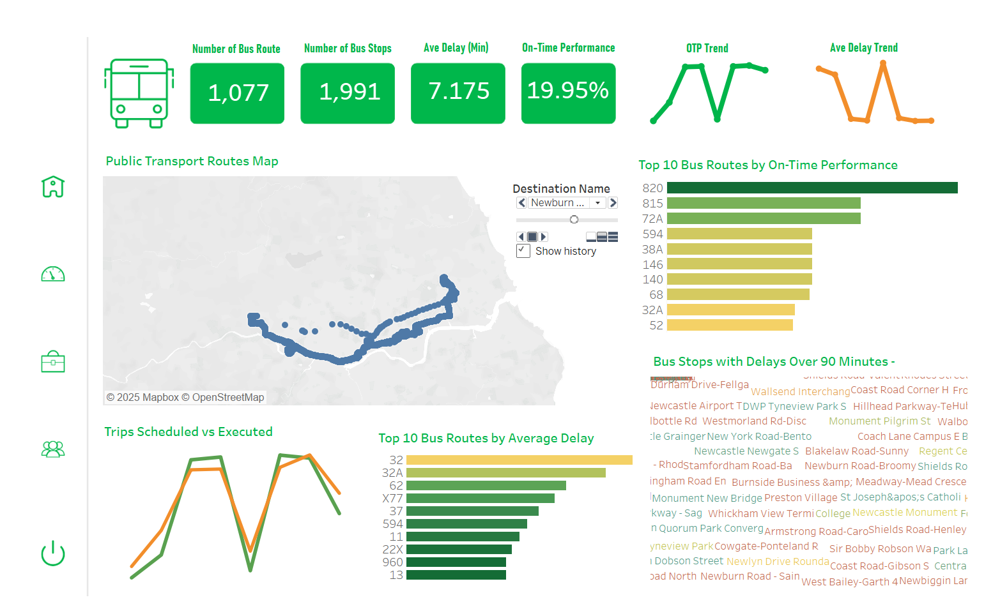
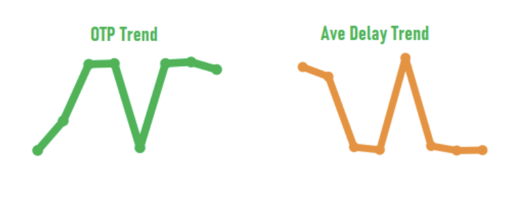
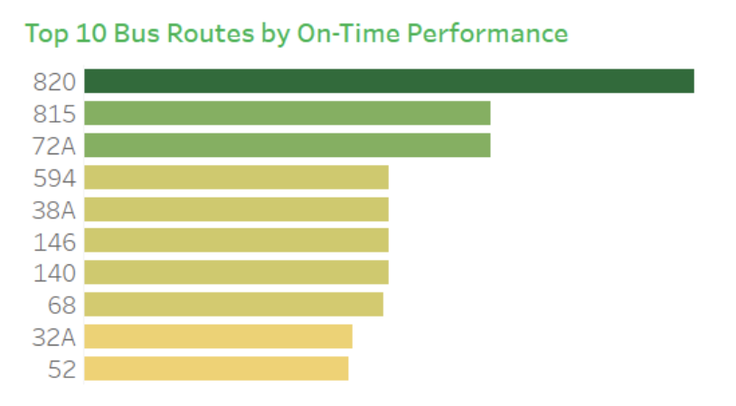
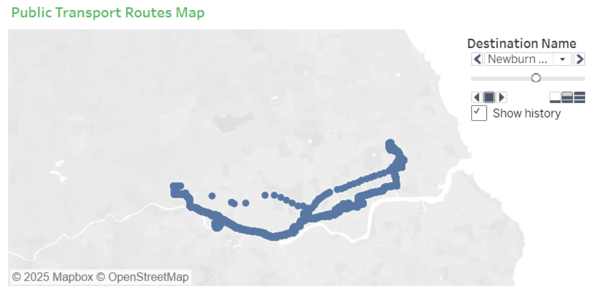

# Assessing Public Transport Reliability Through Dynamic Visualization

## Overview

This project presents an end-to-end analytical workflow for assessing public transport reliability using heterogeneous timetable and realtime operational data. It integrates GTFS, TXC/XML, and operator CSV datasets into a repeatable pipeline for data cleaning, standardisation, metric calculation, anomaly identification, and interactive visualisation.

Developed as part of my MSc Computer Science dissertation at Newcastle University, the project aims to move beyond static reports and retrospective summaries by providing a more dynamic and structured approach to reliability monitoring, abnormal pattern detection, and operational diagnosis.

---

## Research Context

Public transport reliability is a critical issue for both operators and passengers. Delays, cancellations, and inconsistent service patterns reduce operational efficiency and undermine passenger confidence. In practice, many organisations still rely on retrospective analysis and static reporting, which can make it difficult to identify disruptions and emerging performance issues in time.

This project explores how dynamic visualisation, combined with a structured set of reliability indicators, can support more timely and actionable assessment. Rather than focusing on a single metric or isolated visual output, it brings together data integration, KPI design, anomaly-oriented diagnosis, and dashboard generation within one analytical workflow.

---

## Project Objectives

The project was designed around four objectives:

- Build a repeatable workflow for integrating heterogeneous timetable and realtime operational datasets
- Define and calculate core reliability metrics, including on-time performance, average delay, and cancellation rate
- Develop a multi-scale visual diagnosis framework to support route-, stop-, and time-based analysis
- Create an end-to-end prototype linking data processing, metric generation, and decision-support outputs

---

## Main Features

- Integration of GTFS, TXC/XML, and realtime CSV datasets
- Repeatable Python workflow for ingestion, cleaning, matching, aggregation, and export
- Reliability metrics including on-time performance (OTP), average delay, and cancellation rate
- Trip-level matching between scheduled and actual departures
- Route-level and stop-level performance summaries
- Threshold-based anomaly identification for alert-oriented diagnosis
- Interactive dashboard outputs using Plotly and Tableau
- Reproducible end-to-end execution through a single script

---

## Data Sources

The project uses a combination of timetable and realtime public transport data:

- **GTFS ZIP** timetable data
- **TXC/XML** timetable data
- **Operator CSV** realtime operational records

These sources are integrated into a unified workflow for structured reliability analysis.  
Due to repository size and data source constraints, the full raw datasets are not included here. However, the repository structure reflects the intended data workflow and generated outputs.

---

## Analytical Workflow

The workflow is organised into six stages:

1. **Timetable parsing**  
   Extract and parse GTFS ZIP and TXC/XML timetable data.

2. **Realtime data cleaning and standardisation**  
   Read operator CSV files, apply column mapping, parse timestamps, interpolate missing values, and filter abnormal delay values.

3. **Trip-level matching**  
   Match actual departures with scheduled times at origin level to calculate delay, on-time status, and cancellation logic.

4. **Aggregation and KPI generation**  
   Aggregate performance metrics across service date, route, direction, stop, and time-related views.

5. **Anomaly-oriented analysis**  
   Apply thresholds and statistical summaries to identify abnormal service patterns.

6. **Dashboard generation**  
   Export structured outputs and generate interactive visualisations for operational diagnosis.

---

## Repository Structure

```text
.
├── run_all.py                 # Main entry point for end-to-end execution
├── parse_txc.py               # Timetable parsing from GTFS ZIP and TXC/XML
├── process_realtime.py        # Realtime cleaning, matching, and aggregation
├── dashboard.py               # Plotly dashboard generation
├── config.yaml                # Thresholds, column mappings, and settings
├── data/
│   ├── realtime/              # Realtime CSV input files
│   └── timetable_extracted/   # Extracted timetable/XML files
├── output/
│   ├── metrics_summary.csv    # Route/date-level reliability metrics
│   ├── stop_ranking.csv       # Stop-level ranking outputs
│   └── dashboard.html         # Offline interactive dashboard
└── README.md
```

---

## Methods and Design Choices

The project combines practical engineering decisions with an applied research perspective. The workflow was designed not only to process heterogeneous data reliably, but also to produce outputs that are interpretable, reproducible, and useful for operational diagnosis.

### Data Cleaning and Standardisation

The workflow applies several standardisation steps to ensure consistency across heterogeneous timetable and realtime datasets:

- unified column mapping
- timestamp parsing
- data type standardisation
- linear interpolation for selected missing values
- delay filtering based on defined thresholds

These steps help create a more stable analytical pipeline and reduce inconsistencies between different data sources.

### Metric Design

The analysis focuses on a minimum sufficient set of reliability indicators:

- **On-time performance (OTP)**
- **Average / median delay**
- **Cancellation rate**

These metrics were selected to balance interpretability, diagnostic value, and practical relevance. Together, they provide a compact but meaningful basis for assessing service reliability across multiple levels of analysis.

### Storage and Performance

A key technical challenge in the project was handling large, heterogeneous, and frequently updated data efficiently. Early versions using CSV for intermediate storage repeatedly failed during aggregation because of memory issues. The workflow was therefore redesigned around **Parquet**, improving stability and reducing I/O overhead through columnar storage.

This design choice was important in making the end-to-end pipeline more robust and reproducible.

### Research Approach

The project follows a **Design Science Research (DSR)** approach. Rather than focusing only on descriptive analysis, it aims to design and evaluate a practical analytical artefact for real-world diagnosis and monitoring.

This research orientation shaped the project as a full workflow and prototype, rather than as a single isolated visualisation or metric calculation task.

---

## How to Run

The repository is organised to support repeatable execution of the workflow from data preparation to dashboard generation.

### 1. Prepare input data

- Put all realtime CSV files into `data/realtime/`
- Put `TimetableData.zip` into `data/`, or extract XML files into `data/timetable_extracted/`

### 2. Edit configuration

Update `config.yaml` as needed, including:

- thresholds
- column mappings
- data paths

### 3. Run the workflow

```bash
python run_all.py
```

---

### 4. Check generated outputs

The workflow writes results into the `output/` folder.

---

## Outputs

Running the full workflow generates three main outputs:

- **`metrics_summary.csv`**  
  Route/date-level reliability metrics, including OTP and delay statistics

- **`stop_ranking.csv`**  
  Stop-level ranking based on delay and on-time performance

- **`dashboard.html`**  
  Offline interactive dashboard for KPI tracking and operational diagnosis

Together, these outputs support both high-level performance monitoring and more detailed issue diagnosis.

---

## Dashboard Functions

The dashboard prototype was designed to support multi-scale operational diagnosis. It includes:

- KPI summary cards
- trend charts for OTP and delay
- route-level performance rankings
- stop-level delay diagnosis
- spatial visualisation of routes and stops
- planned vs actual service comparison
- interactive filters and tooltips
- alert-oriented views for abnormal conditions

The visual design supports analysis across different levels, from network-wide trends to route- and stop-level diagnosis.

---

## Example Findings

The project identified several meaningful operational patterns:

- low on-time performance and high delay peaks often appeared on the same day across multiple routes, suggesting broader systemic interference rather than isolated route failures
- clear directional differences were observed within the same route, with inbound and outbound performance curves showing systematic separation
- weekday midday periods showed extreme delays in the 60–100 minute range
- reliability issues were better understood through multi-level diagnosis rather than a single overall average

These findings highlight the value of combining data integration, KPI design, and visual diagnosis within a single workflow.

---

## Dashboard Preview

### Dashboard Overview
Overall dashboard layout showing KPI cards, trend views, and route-level diagnostic panels.



### OTP / Delay Trend
Example trend view used to compare changes in on-time performance and delay over time.



### Route Ranking View
Ranking-based comparison of routes with stronger or weaker reliability performance.



### Map View
Spatial view of route and stop distribution used to support location-based diagnosis.



---

## Limitations

Like any applied prototype, this project has several limitations:

- the case study is based on a limited observation period
- the current Plotly implementation generates static HTML outputs rather than a fully deployed live dashboard
- some alert and subscription logic was designed conceptually or prototyped, but not deployed in a live operational environment
- full raw datasets are not included in the repository

These limitations also point to several useful directions for future improvement.

---

## Future Work

There are several possible directions for extending the project:

- automated scheduling of the workflow
- CI/CD support for continuous updates
- richer dashboard interactivity
- monitoring integration using tools such as Prometheus and Grafana
- improved deployment support for more continuous operational use
- broader validation across additional routes, periods, or geographic settings

These extensions would help move the project further towards continuous monitoring and operational deployment.

---

## Tech Stack

The project draws on a combination of data processing, storage, and visualisation tools:

- **Python**
- **Pandas**
- **Plotly**
- **Dash** (prototype design context)
- **Tableau**
- **Parquet**
- **Mapbox**

---

## Academic Context

This repository is based on my MSc Computer Science dissertation project at Newcastle University:

**Assessing Public Transport Reliability Through Dynamic Visualization**

The project focuses on integrating heterogeneous operational datasets into a reproducible analytical workflow for reliability assessment and visual decision support.
